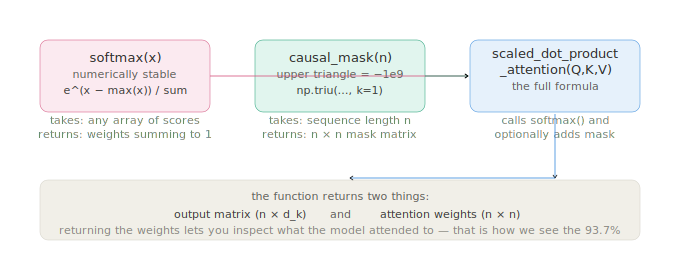

# The implementation

The code is 23 lines. I want to say that up front because I spent a significant amount of time imagining it would be more, building up a mental picture of something complex and forbidding, and the gap between that picture and what the actual implementation looks like when you have written it is itself a useful thing to sit with. Twenty-three lines that do something real. Here is what each part is doing and why it is there.



---

## softmax

```python
def softmax(x):
    e_x = np.exp(x - np.max(x, axis=-1, keepdims=True))
    return e_x / e_x.sum(axis=-1, keepdims=True)
```

The first thing to notice is the subtraction before the exponent: `x - np.max(x, axis=-1, keepdims=True)`. This is not in the mathematical formula, it is a numerical stability fix. If the values in x are large, `np.exp(x)` can overflow to infinity, which breaks everything downstream. Subtracting the maximum value first shifts the inputs so the largest becomes zero before we exponentiate, which keeps the numbers inside a workable range. Crucially, this does not change the output, because the max term cancels out in the division. You get mathematically identical results and you do not get numpy telling you it has hit a floating point limit.

The `axis=-1` argument tells numpy to compute the max and the sum along the last axis, which means each row gets its own normalisation. When you have a matrix of attention scores rather than a single row, this ensures each query's weights sum to one independently rather than softmax being computed across the whole matrix at once.

---

## causal_mask

```python
def causal_mask(n):
    return np.triu(np.full((n, n), -1e9), k=1)
```

`np.triu` returns the upper triangle of a matrix. `k=1` means it starts one position above the main diagonal, so the diagonal itself stays at zero. What you get back is a matrix that is zero everywhere on and below the diagonal and negative one billion everywhere above it. When this gets added to the attention scores before softmax, the upper-triangle positions become so negative that their softmax weights are effectively zero, which is what enforces the causal constraint — each position can only see itself and what came before.

Negative one billion is a chosen number rather than a theoretically derived one. It just needs to be large enough that `e^(−1,000,000,000)` rounds to zero in floating point arithmetic, and it does. In practice you will also see `float('-inf')` used for this, which is more explicit about the intent, but the result is the same.

---

## scaled_dot_product_attention

```python
def scaled_dot_product_attention(Q, K, V, mask=None):
    scores = Q @ K.T / math.sqrt(Q.shape[-1])
    if mask is not None:
        scores = scores + mask
    weights = softmax(scores)
    return weights @ V, weights
```

`Q @ K.T` is the matrix multiplication that produces all the dot products at once. `K.T` is the transpose of K, so a 4 × 8 query matrix times an 8 × 4 key transpose gives you the 4 × 4 scores matrix. `Q.shape[-1]` is the key dimension d_k, which is 8 here, so `math.sqrt(Q.shape[-1])` is the scaling factor. The function reads the dimension from the actual input rather than having it hardcoded, which means it works regardless of how large or small your embedding dimension is.

The mask is optional and gets added rather than applied as a separate step, which means the whole sequence of operations — score, scale, mask, softmax — is one clean expression: `softmax(Q @ K.T / √d_k + mask)`. That is the formula from the paper, implemented directly.

The function returns two things: the output matrix and the attention weights. Returning the weights is a design choice rather than a necessity, but it is the choice that lets you look inside what the model decided. Without it you would have the output but you would not be able to inspect the 93.7% or plot the heatmap or see anything about what happened during the computation. Transparency about the mechanism is useful whether you are debugging code or thinking about governance.

---

## The main block

```python
sentence = ["the", "corpus", "was", "wrong"]
np.random.seed(42)
token_embeddings = np.random.randn(len(sentence), 8)
W_Q = np.random.randn(8, d_k)
W_K = np.random.randn(8, d_k)
W_V = np.random.randn(8, d_k)
Q = token_embeddings @ W_Q
K = token_embeddings @ W_K
V = token_embeddings @ W_V
mask = causal_mask(len(sentence))
output, weights = scaled_dot_product_attention(Q, K, V, mask)
```

The weight matrices W_Q, W_K, W_V are random. In a real transformer they would be learned during training on a large corpus. Here they are just noise. The fact that "wrong" still attends most heavily to "corpus" under random weights is partly interesting and partly just a feature of the random seed — a different seed would give different results. What is not random, and what does carry over regardless of the specific weights, is the mechanism itself: the architecture enforces a particular kind of computation, and that computation is what we are building understanding of.

The seed is set to 42, which is a convention in machine learning examples rather than a meaningful choice. It makes the results reproducible, so every time you run this you see the same 93.7%, rather than a different number each time. If you want to see how much the result varies with different seeds, that is a worthwhile experiment to run.

---

→ [Back to the mathematics](Mathematis.md) · [Next: the tiling pass](tiling.md)
