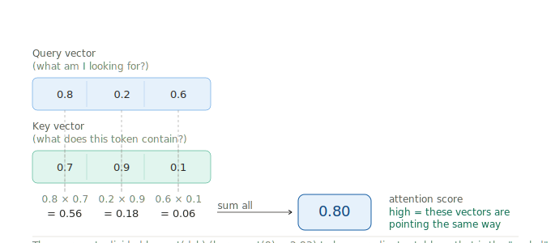
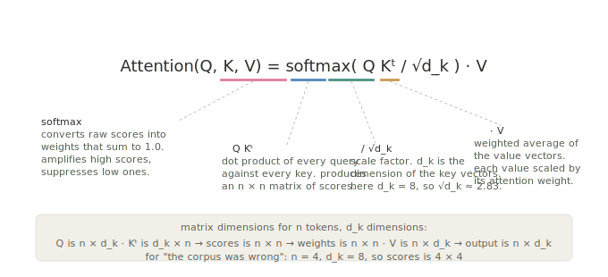
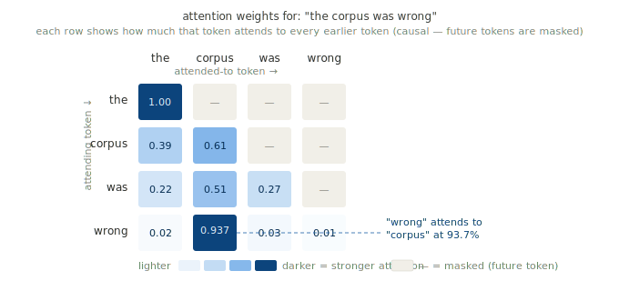

# What attention actually is
Despite already reading about attention and attempting to implemenmt it (in my undergrad dissertation on transformer models) it didnt truly click until i dove into its output and thought: I got to see  how the machine chooses. And then immediately after that, I  also realised that there is no perfection here. It is all numbers, weighted combinations of numbers, all the way down.
That sounds deflating when I write it out but it was not deflating at the time. i howevewr found it clarifying at the time ecause the gap between what these systems appear to do and what they are actually doing is where most of the harm lives, and that gap is hard to close when you are reasoning about it from the outside. You need the mechanism. You need to know what the dot product is.
So let me start there.

When I ran my own sentence through the finished code and looked at the output. The sentence was "the corpus was wrong",  I had chosen it deliberately because I had written an essay arguing exactly that, that the datasets training most of the language models we are deploying were assembled in ways that systematically over-represented certain voices and under-represented others. 

That this is not a correctable edge case but a structural condition because what the model learns to attend to is shaped by what the corpus taught it to attend to, and when I ran those four words through the attention mechanism I had just built, the word "wrong" attended most heavily to "corpus" at 93.7%. 
The model, operating on random weight matrices and a sentence it had no context for, found the relationship my essay had been working to establish.

I want to be careful about what I say that means. The weight matrices were random, a different seed would have produced different weights, and the model was not "understanding" anything. But the mechanism was doing exactly what it is designed to do, and seeing that actually watching the numbers produce that result is when the closed thing opened.
So here is what the mechanism is actually doing.

Everything in attention comes back to one operation: the dot product. If you did not study linear algebra or if you studied it a long time ago and it has gone soft, that is fine, it is genuinely simpler than its reputation. A vector is just a list of numbers. Each word in the input gets represented as a list of numbers, in this implementation, a list of eight, where those numbers encode something about the word's meaning in a mathematical space where related things end up close to each other. The dot product is how you measure how close.

You take two vectors and multiply their first numbers together, then their second, then their third, and so on through all eight, and then you add all those products into a single number. If the two vectors are pointing in the same direction, if the words are, in the model's estimation, related, you get a high number. If they are pointing away from each other, you get something low or negative. If they have nothing to do with each other, you get something near zero.

That number is the attention score between those two tokens. It is not a judgement, it is not comprehension, it is the cosine of an angle between two lists of numbers, but it functions as relevance, and that is what the model uses to decide what to attend to. The "scaled" in scaled dot-product attention refers to dividing that score by the square root of the vector dimension here, the square root of eight, roughly 2.83, which keeps the numbers from getting large enough to push the softmax into regions where gradients become very small and training slows down. It is one of those details that looks arbitrary until you understand what breaks without it.
# Why there are three matrices and not one
This is the part I found most elegant once it clicked. Each word in the input does not just get one vector representation, it gets projected into three different spaces using three different learned weight matrices, and those three projections do three distinct things.

The Query is the question the token is asking. What do I need to know? What should I be attending to in order to do my job in this sequence? The Key is the token advertising its contents, this is what I contain, this is what you can find me by. The Value is what the token actually contributes when it is selected, not its label or identity but the information it carries forward into the output.
The mechanism runs a soft lookup across all of those. The query compares itself against every key using the dot product, gets a score for each one, passes those scores through softmax to turn them into weights that sum to one, and then uses those weights to construct a weighted average of all the values. High-scoring tokens contribute more, low-scoring tokens contribute less, and what comes out the other end is a new representation of the original token that has been shaped by everything it chose to attend to.

"the" can only see itself, so all of its attention weight goes to itself. "corpus" splits attention between "the" and itself. "was" looks back across all three preceding tokens and distributes its weight between them. And then "wrong" looks back across the whole sentence and assigns 93.7% of its attention weight to "corpus", with very little left for anything else.
The model did not know I had written an essay. It had no access to the argument I was making, no understanding of why those words were in that order, no knowledge of what "wrong" means in the context of AI governance. What it had was random weight matrices and a mathematical operation for measuring the angle between vectors, and when it applied those to those four words in that order, it gave me the relationship I had been trying to articulate for several hundred words of careful analytical writing. 

# The part that matters for governance
I have written at length about the gap between what these systems appear to do and what they are actually doing, and the attention mechanism is one of the clearest places where that gap becomes visible if you look for it. The model is not choosing what to attend to. It is computing dot products, applying an exponential function, dividing by the sum to get a probability distribution, and constructing weighted averages. There is no selection happening in any sense that involves intention or understanding. And yet the outputs of that process are treated, by the people using these systems and often by the researchers building them, as if relevance judgements are being made, as if the model has some idea of what matters.
The corpus shapes what the weight matrices learn during training. The weight matrices determine which vectors end up close to which in this high-dimensional space. The geometry of that space determines which dot products come out high. The high dot products become the high attention weights. The high attention weights shape what the model produces. And what the model produces is increasingly what people encounter as authoritative response, as search result, as suggested text, as generated report. Understanding that chain from the dot product to the deployment is not sufficient for good governance but it is a necessary part of it, and you cannot make that argument clearly if you do not know what the dot product is.

→ [Back to motivation](motivation.md) · [Next: the mathematics](Mathematis.md)